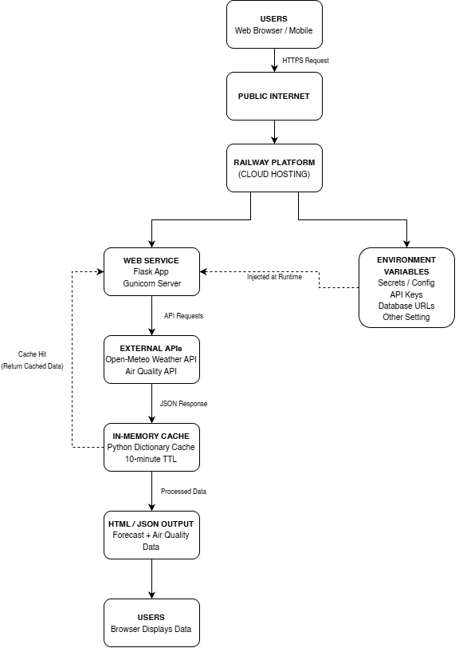

# Skyline Weather Radar

Skyline Weather Radar is a cloud-based weather and air quality monitoring web application built using Flask and deployed on Railway. The platform provides real-time weather forecasts, hourly updates, air quality information, and location-based weather analytics using external APIs.

---

## 🌐 Live Demo

https://finaleprojectdeproglang-production.up.railway.app/

---

## 🎥 Demo Video

[](https://youtu.be/IGsHmv3Nmi8)

---

# 📌 Project Overview

This project was developed as a Final Project for Cloud Computing. The application demonstrates cloud deployment concepts, scalability, performance optimization, monitoring readiness, and secure web application architecture.

The platform allows users to:

* Search locations worldwide
* View current weather conditions
* Access hourly weather forecasts
* View 7-day weather forecasts
* Monitor air quality metrics
* Retrieve real-time environmental data

---

# 🚀 Features

## Weather Information

* Current temperature
* Feels-like temperature
* Humidity
* Wind speed and direction
* Hourly forecasts
* 7-day forecasts

## Air Quality Monitoring

* Air Quality Index (AQI)
* PM2.5 and PM10 levels
* Ozone metrics
* Carbon monoxide metrics
* Nitrogen dioxide metrics

## Cloud Features

* Railway cloud deployment
* HTTPS-secured web application
* Stateless Flask architecture
* API response caching
* Environment variable configuration
* CI/CD-ready workflow

---

# 🛠️ Technologies Used

## Backend

* Python
* Flask
* Requests

## Cloud & Deployment

* Railway
* GitHub

## APIs

* Open-Meteo Weather API
* Open-Meteo Air Quality API

---

# 🏗️ Architecture Diagram

The following diagram illustrates the cloud deployment architecture of Skyline Weather Radar.



---

# ☁️ System Architecture

```text
Users → Internet → Railway Hosting → Flask Application
                                         ↓
                           Open-Meteo Weather APIs
                                         ↓
                              Cached API Responses
                                         ↓
                               Browser Weather UI
```

---

# ⚡ Cloud Optimizations

## 1. Scalability

* Stateless Flask application
* Gunicorn production server
* Supports horizontal scaling

## 2. Performance Optimization

* In-memory caching system
* Reduced repeated API requests
* Faster response times

## 3. Security

* HTTPS enabled
* Environment variables used for configuration
* No hardcoded credentials

## 4. DevOps Readiness

* GitHub integration
* CI/CD deployment compatible

---

# 📂 Project Structure

```text
/
├── diagram/
│   └── architecture.png
├── static/
├── templates/
├── app.py
├── requirements.txt
├── Procfile
├── runtime.txt
└── README.md
```

---

# 🔌 API Endpoints

## Home Page

```http
GET /
```

Returns the main web application interface.

---

## Geocoding API

```http
GET /api/geocode?name=manila
```

Returns matching locations and coordinates.

---

## Weather API

```http
GET /api/weather?lat=14.5995&lon=120.9842
```

Returns:

* Current weather
* Hourly forecast
* Daily forecast
* Air quality information

---

# 💻 Local Development Setup

## Clone Repository

```bash
git clone <repository-url>
cd skyline-weather-radar
```

---

## Create Virtual Environment

```bash
python -m venv venv
```

### Windows

```bash
venv\Scripts\activate
```

### Linux / macOS

```bash
source venv/bin/activate
```

---

## Install Dependencies

```bash
pip install -r requirements.txt
```

---

## Run Application

```bash
python app.py
```

Application runs locally at:

```text
http://127.0.0.1:5000
```

---

# 📦 requirements.txt

```txt
Flask
requests
gunicorn
```

---

# 🚂 Procfile

```text
web: gunicorn app:app
```

---

# 🔄 Deployment Workflow

1. Developer pushes code to GitHub
2. Railway automatically detects changes
3. Dependencies are installed automatically
4. Flask application launches using Gunicorn
5. Public HTTPS deployment becomes available

---

# 🔒 Security Considerations

* HTTPS enforced by Railway
* Environment variables used for configuration
* Secure API communication over HTTPS
* No hardcoded deployment credentials

---

# 📈 Future Improvements

Potential future enhancements include:

* Redis distributed caching
* User authentication system
* Favorite/saved locations
* Database integration
* Docker containerization
* Azure cloud migration
* GitHub Actions CI/CD automation
* Monitoring and telemetry integration

---

# 💰 Cost Optimization

The application minimizes cloud operational costs through:

* Lightweight Flask architecture
* API response caching
* Free-tier cloud hosting
* Minimal infrastructure requirements

---

# 👨‍💻 Developers

Cloud Computing Final Project
AY 2025–2026, 2nd Semester

---

# 📄 License

This project is for educational purposes only.
